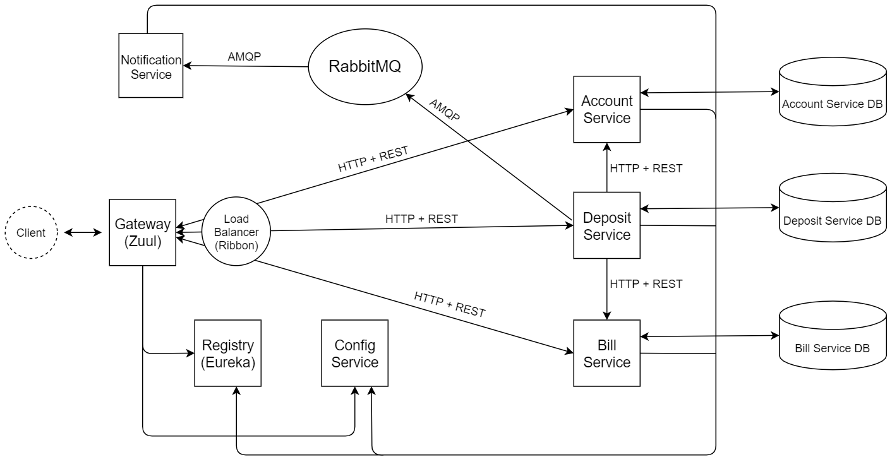

# Bank Management System with Deposits
Microservices with Spring Boot & Spring Cloud

## Technologies :bulb:
- **Java 11**
- **Gradle**
- **Spring (Boot, Web, Data, Cloud, Test)**
- **Hibernate**
- **PostgreSQL**
- **Docker**, **Docker Compose**, **Bash**
- **JUnit**, **AssertJ**, **Mockito**, **H2 Database**
- **Slf4j**
- **Lombok**
- **ModelMapper**
- **RabbitMQ**
- **Eureka server** (registry)
- **Zuul** (gateway)
- **Ribbon** (load balancer)

## Deployment :rocket:
#### Required software:
- terminal for running bash scripts (e.g., Git Bash)
- docker

#### Steps:
1) Clone this repository `git clone https://github.com/podchez/bank-microservices.git`
2) From the root folder of the project - **type in the terminal `bash start.sh`**

(the application should start locally, gateway port - 8989)

## API Documentation 📄
- http://localhost:8989/accounts/ (GET, POST)
- http://localhost:8989/accounts/{id} (GET, PUT, DELETE)
---
- http://localhost:8989/bills/ (GET, POST)
- http://localhost:8989/bills/{id} (GET, PUT, DELETE)
---
- http://localhost:8989/deposits/ (GET, POST)
- http://localhost:8989/deposits/{id} (GET)

## Architecture 📐

